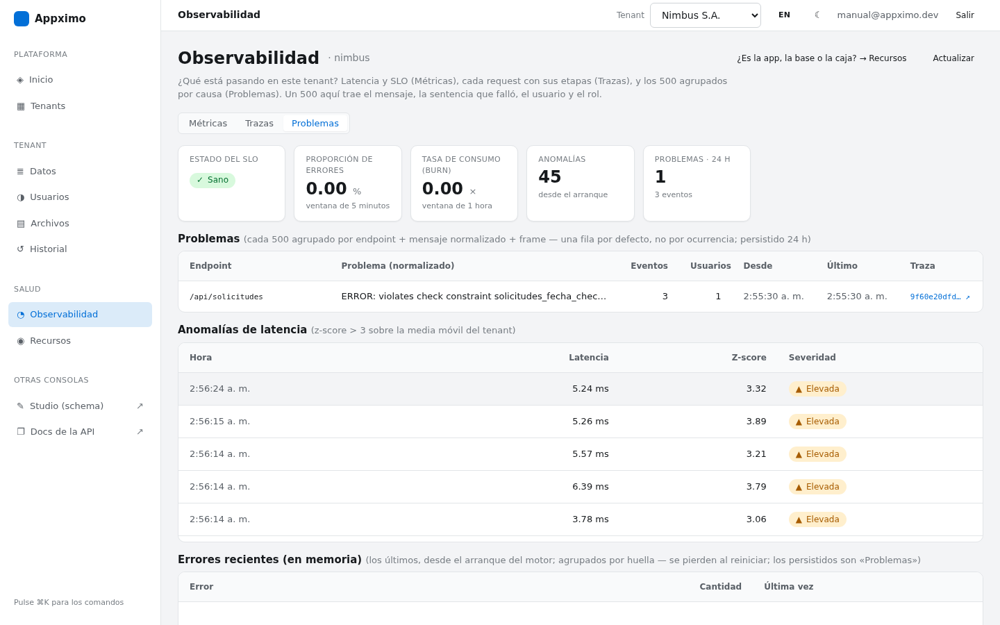
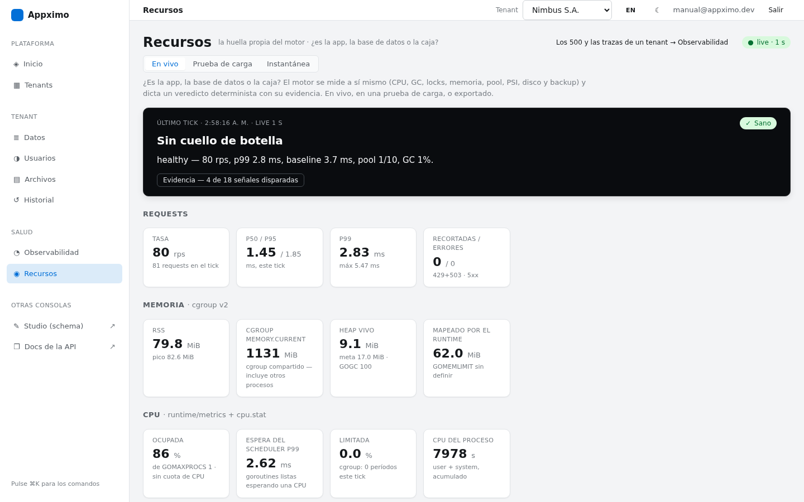
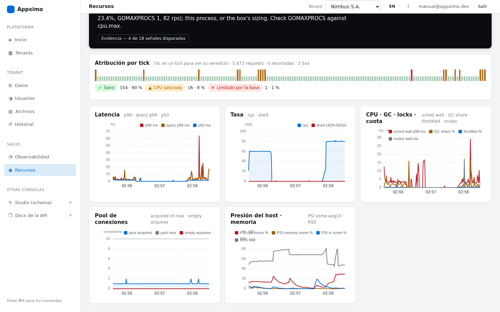
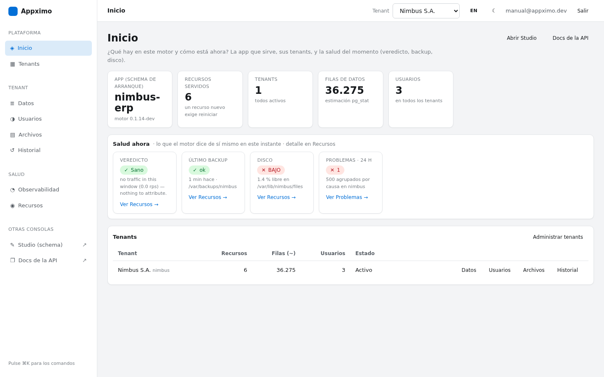
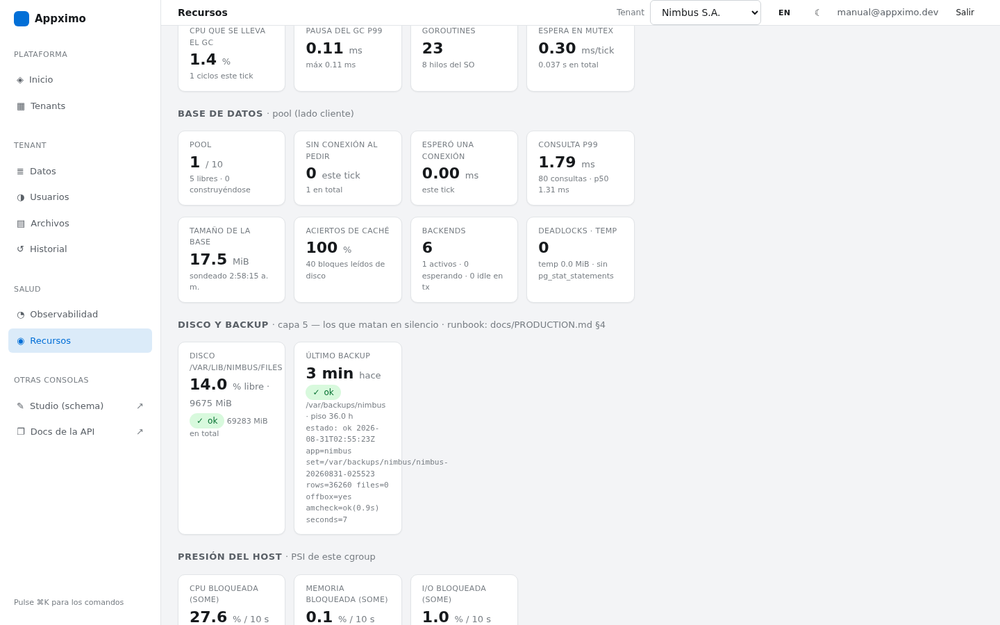
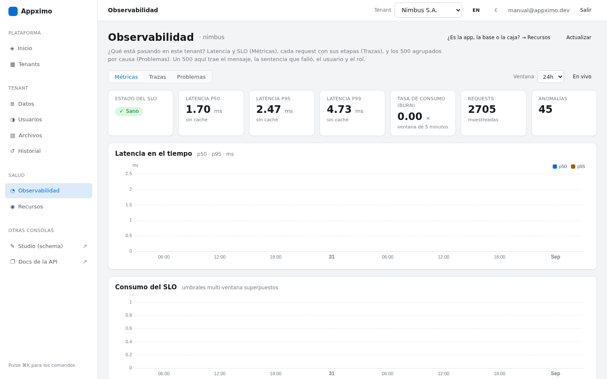

# Manual de operación de Appximo

**Para quien tiene que operar una app hecha con Appximo** — el dueño, o el desarrollador de un cliente — y no quiere tener que preguntar. Está escrito en español y en lenguaje llano; la referencia técnica en inglés sigue siendo [docs/PRODUCTION.md](PRODUCTION.md) y [docs/CAPABILITIES.md](CAPABILITIES.md). Este documento no las repite: dice **qué hace el motor, dónde se ve cada cosa, qué se puede cambiar, qué hacer cuando pasa algo, y cómo repetir cualquier escenario con un comando**.

Regla del manual: **ninguna afirmación sin el comando o la ruta que la respalda.** Todos los comandos de este documento se ejecutaron el 2026-08-31 contra un motor real (la caja del laboratorio `tools/lab` — un droplet de 2 vCPU / 2 GB instalado con `scripts/install.sh` — y un motor de desarrollo con datos de una empresa de ejemplo). Las capturas son de esas mismas corridas, con el panel en español. El índice de todo lo que existe, por área, está en [docs/ESTADO_DEL_MOTOR.md](ESTADO_DEL_MOTOR.md).

**Índice**

1. [Qué hace el motor hoy](#1-qué-hace-el-motor-hoy)
2. [Qué ve y dónde](#2-qué-ve-y-dónde)
3. [Qué puede cambiar y qué mueve cada cosa](#3-qué-puede-cambiar-y-qué-mueve-cada-cosa)
4. [Qué hacer cuando pasa algo](#4-qué-hacer-cuando-pasa-algo)
5. [Cómo desplegar y cómo poner al día una caja vieja](#5-cómo-desplegar-y-cómo-poner-al-día-una-caja-vieja)
6. [Repetir cualquier escenario: `appximo drill`](#6-repetir-cualquier-escenario-appximo-drill)
7. [Qué NO hace el motor](#7-qué-no-hace-el-motor)
8. [Apéndice: dónde vive cada cosa en la caja](#8-apéndice-dónde-vive-cada-cosa-en-la-caja)
9. [El centro de mando: toda la operación en una pantalla](#9-el-centro-de-mando-toda-la-operación-en-una-pantalla)

---

## 1. Qué hace el motor hoy

Appximo es **un binario** que, a partir de un archivo `schema.json`, levanta una API completa (REST + GraphQL + su documentación) sobre PostgreSQL, con un cliente (tenant) por subdominio y datos aislados por tenant. Lo que un operador necesita saber que existe, sin adornos:

| Área | Qué hay | Cómo se ve |
|---|---|---|
| **La app** | REST (`/api/<recurso>`), GraphQL (`/graphql`), documentación interactiva (`/docs`), un panel de datos genérico para el dueño (`/app`), un editor visual del schema (`/editor`, «Studio») | `curl https://SU-DOMINIO/health` responde `{"status":"ok","version":"…"}`; `/docs` abre en el navegador |
| **Usuarios** | Registro/login/recuperación de contraseña, login social (Google, GitHub, Microsoft), segundo factor TOTP; roles y permisos por fila declarados en el schema (RBAC) | `/admin` → **Usuarios**; `POST /auth/login` |
| **El panel de administración** | `/admin`: tenants, usuarios, datos (solo lectura), archivos, historial de versiones del schema, **Observabilidad** (latencia, SLO, cada request con sus etapas, los 500 explicados) y **Recursos** (el motor midiéndose a sí mismo y diciendo si el cuello es la app, la base o la caja). En español o inglés (botón `ES`/`EN` arriba a la derecha) | `https://SU-DOMINIO/admin` |
| **Protecciones bajo carga** | Control de admisión (rechaza con 429 antes de volcarse), límite de tasa por tenant, guardia de memoria (503 en escrituras cuando la caja está por quedarse sin RAM), breaker hacia la base (503 rápidos cuando la base no responde) | §3 y `appximo drill saturate` |
| **Backup y restauración** | Un backup nocturno completo (base + archivos subidos + secretos + manifiesto de conteos), con verificación de índices (`pg_amcheck`), copia fuera de la caja opcional; una restauración cronometrada y verificada | `sudo bash /opt/<app>/scripts/backup.sh --app=<app>` · `sudo bash /opt/<app>/scripts/restore.sh --app=<app> --set=…` · `appximo drill restore` |
| **Alertas** | Backup fallido o viejo, disco bajo, SLO quemándose, el primer 500 de cada tipo nuevo — a Slack si `SLACK_WEBHOOK_URL` está puesto; si no, una línea en el journal | `journalctl -u <app> -o cat \| grep -i alert` |
| **Despliegue** | Un comando que hace backup, cambia el binario, **verifica desde afuera** (versión, lectura, escritura que se deshace) y **se revierte solo** si algo falla | `scripts/deploy-app.sh` (§5) |
| **Auditoría de la caja** | Un comando que dice **qué falta** (timer de backup, copia fuera, destino de alertas, swap, checksums, política de reinicio de PostgreSQL) | `appximo drill audit` |
| **Simulacros** | Diez experimentos de caos, un 500 real, carga, saturación, restauración — cada uno con «qué va a pasar» y «dónde mirarlo» | `appximo drill list` |

Lo que hay debajo (para ubicarse, no para operar): Go 1.25 sin CGO, un solo proceso, PostgreSQL con un schema por tenant, Caddy delante con HTTPS automático, systemd que reinicia el proceso si se cae. Una app es **una caja** (§7).

---

## 2. Qué ve y dónde

Todo lo de esta sección está en `https://SU-DOMINIO/admin`. Se entra con el super-administrador de la plataforma (el primero se crea desde la misma pantalla de login con el `ADMIN_KEY` del servidor, o con `appximo admin create --email … --password …`). Arriba a la derecha se elige el **tenant** sobre el que operan Datos, Usuarios, Archivos, Historial y Observabilidad; Inicio y Recursos son de todo el motor.

Cada sección tiene una línea debajo del título que dice qué pregunta responde. Si se pierde, esa línea es el mapa.

### 2.1 Un 500 con su causa, su consulta y su usuario

**Dónde:** `/admin` → elija el tenant → **Observabilidad** → pestaña **Problemas** (`/admin#/observability?tab=issues`).



- **Problemas (24 h)**: una fila por *defecto*, no por ocurrencia — los 500 se agrupan por endpoint + mensaje normalizado + la función donde se capturó. La fila trae cuántos eventos, cuántos usuarios distintos, desde cuándo, y un enlace **↗** a una traza de ejemplo.
- Al hacer clic en la traza se abre en **Trazas** con la **cascada**: la etapa que falló marcada `✗ falló aquí`, **el mensaje del error tal como lo dio la base**, **la sentencia SQL que el driver rechazó** (sin los valores), **el usuario y el rol** que la mandaron, y **Copiar como curl** para reproducirla (la autorización nunca se guarda; el curl lleva `$TOKEN`).


- La misma información está en el **journal** como una línea JSON por 500, con `trace_id`, `sql` y `site`:

  ```bash
  journalctl -u <app> -o cat --since -1h | grep '"level":"error"' | tail -3
  ```

- La **primera vez** que aparece un tipo nuevo de 500, el motor dispara una alerta (a Slack si `SLACK_WEBHOOK_URL` está puesto; si no, `journalctl -u <app> -o cat | grep -i alert`).
- **Errores recientes (en memoria)**, más abajo en la misma pestaña, es la lista corta desde el último arranque; se pierde al reiniciar. Los persistidos de 24 h son «Problemas».

Para provocar uno y verlo con sus propios ojos: `appximo drill error --app=<app>` (§6).

### 2.2 Los errores agrupados y las anomalías de latencia

**Dónde:** la misma pestaña **Problemas**. Debajo de los problemas están las **anomalías de latencia** (requests cuya latencia se salió más de 3 desviaciones de la media móvil del tenant) y el estado del **SLO** (sano / alerta / crítico, con la proporción de errores de 5 minutos y la tasa de consumo del presupuesto de error).

### 2.3 El consumo de recursos y el veredicto del cuello de botella

**Dónde:** `/admin` → **Recursos** (`/admin#/resources?tab=live`). No depende del tenant: es el proceso entero.



- La franja negra es **el veredicto**: cada 10 s (1 s mientras la pantalla está abierta) el motor se mide — CPU, GC, locks, memoria, pool de conexiones, latencia de consultas, presión del host — y **dice en una frase de quién es el problema**: `Sano`, `CPU saturada` (la app o el tamaño de la caja), `Pool agotado` (la base o la configuración del pool), `Limitado por la base`, `Presión de memoria`, `CPU limitada (quota)` (el plan del proveedor, no el código), `Presión del GC`, `Contención de locks`. El botón **Evidencia** muestra las señales y sus umbrales — es una regla determinista, no una adivinanza.
- La pestaña **Prueba de carga** (`?tab=load`) muestra la **atribución por tick** durante una corrida y cinco gráficas correlacionadas (latencia, tasa, CPU/GC/locks, pool, presión del host). Es la pantalla para mirar mientras corre `appximo drill load` o `saturate`.



- **Instantánea** exporta la corrida entera como JSON, para pegarla en un reporte o compararla con otra.
- Lo mismo, para máquinas: `curl -H "X-Admin-Key: $ADMIN_KEY" http://127.0.0.1:<puerto>/admin/resources?live=1` desde la caja, y las 21 métricas `appximo_selfmon_*` en `/metrics`.

### 2.4 El estado del backup y del disco

**Dónde:** dos lugares. En **Inicio** (`/admin#/`), la franja **Salud ahora** trae cuatro tarjetas — veredicto, último backup, disco, problemas de 24 h del tenant elegido — cada una con un enlace a la pantalla que la explica. Y en **Recursos → En vivo**, la fila **Disco y backup** al final.





- **Último backup**: `ok` / `VIEJO` (más de 36 h — `APPXIMO_BACKUP_MAX_AGE`) / `FALLÓ` / `NUNCA CORRIÓ`, con hace cuánto y la línea exacta que dejó `backup.sh` en `last-backup.status`. Si dice *no vigilado*, falta `APPXIMO_BACKUP_DIR` en el env (el instalador lo pone).
- **Disco**: por cada ruta que importa (archivos subidos, la base de observabilidad, el directorio de backups, `/`) el porcentaje libre y `BAJO` cuando cruza el piso (10 % o 1 GiB, `APPXIMO_DISK_MIN_FREE_PCT`/`_MB`).
- Las dos disparan la misma alerta que los 500 (Slack o journal), una vez cada 6 horas por clase.
- Desde la terminal: `cat /var/backups/<app>/last-backup.status` y `df -h /var/backups/<app>`.

### 2.5 Las métricas y los SLO

**Dónde:** **Observabilidad → Métricas** (`?tab=metrics`): p50/p95/p99 sin caché, requests muestreadas, anomalías, y dos gráficas — latencia en el tiempo y consumo del SLO con sus umbrales (6× alerta, 14,4× crítico). El botón **En vivo** actualiza cada 5 s.



- Cada lectura de la API también trae su tiempo en el encabezado `Server-Timing` (`query;dur=…` es la base de datos). El `/app` lo muestra al pie de cada lista.
- Para Prometheus: `/metrics` con `X-Admin-Key`.

### 2.6 Lo demás del panel, en una línea cada uno

| Sección | Responde | Ruta |
|---|---|---|
| **Inicio** | ¿Qué hay en este motor y cómo está ahora? | `/admin#/` |
| **Tenants** | ¿Qué instancias existen? Crear (con su schema), suspender, borrar (escribiendo el id) | `/admin#/tenants` |
| **Datos** | ¿Qué datos tiene este tenant? Solo lectura; para editar, el `/app` del tenant | `/admin#/data` |
| **Usuarios** | ¿Quién entra y con qué rol? Crear, cambiar rol, suspender | `/admin#/users` |
| **Archivos** | ¿Qué subió este tenant? Descargar (URL firmada), borrar | `/admin#/files` |
| **Historial** | ¿Qué versiones del schema se desplegaron? Ver cualquiera; volver atrás desde Studio | `/admin#/history` |
| **Studio** | Diseñar y desplegar el schema (con vista previa de la migración y aprobación de borrados) | `/editor` |
| **Docs de la API** | El contrato OpenAPI, para probar desde el navegador | `/docs` |

---

## 3. Qué puede cambiar y qué mueve cada cosa

Todo se configura con variables de entorno en **`/etc/<app>/<app>.env`** (una instalación con `install.sh`) — después de cambiar una, `sudo systemctl restart <app>`. El motor **lee las tres obligatorias** (`DATABASE_URL`, `JWT_SECRET` de ≥ 32 caracteres, `ADMIN_KEY`) y **no arranca sin ellas**, nombrando cuál falta. Un valor inválido en una perilla de seguridad (admisión, guardia de memoria, límite de login, colector) **tampoco arranca** — dice cuál; las demás avisan y siguen con el default.

**De dónde salen los defaults**: cada fila lo dice. «Medido» significa que hay un número en [BENCHMARKS.md](BENCHMARKS.md) detrás; «convención» significa que alguien lo eligió y lo escribió; «Go/PostgreSQL» significa que es el default del runtime.

| Variable | Qué hace | Default | De dónde sale el default | Cuándo tocarla | Si se pasa |
|---|---|---|---|---|---|
| `RATE_LIMIT_RPS` / `RATE_LIMIT_BURST` | Límite de requests por segundo **por tenant** (equidad entre tenants y freno de abuso); el exceso recibe `429 rate limit exceeded` | `350 × vCPU` / `100` | **Medido**: 70 % del techo limpio por núcleo de la lectura canónica sin caché en una caja compartida de 2 vCPU (~500 rps/vCPU, [BENCHMARKS §4e](BENCHMARKS.md)); el 70 % es la rodilla de latencia M/M/1 en ρ = 0,7. El motor lo imprime al arrancar: `rate limiter: 700 RPS (derived …)` | Un tenant legítimo con más de 350 rps/vCPU sostenidos (una integración por lotes, una demo pública con una sola cuenta) | El limitador deja de proteger a los demás tenants de uno abusivo; la capacidad real la cuida la admisión, no esto |
| `APPXIMO_MAX_INFLIGHT` | **Control de admisión**: cuántas requests puede haber **en vuelo** a la vez; el exceso recibe `429 server at capacity` + `Retry-After: 1` *antes* de hacer trabajo | `auto` = máx(32, 4 × (vCPU + pool)) — 48 en 2 vCPU con pool 10 | **Medido** ([BENCHMARKS §4e](BENCHMARKS.md)): sin admisión el motor no degrada, **vuelca** (p50 1 728 ms, 79 013 timeouts a 4 800 rps); con ella +20 % de goodput, p50 36 ms, 0 timeouts. La cola de 48 son decenas de ms de espera en el techo | Casi nunca. `0` la apaga (para medir el volcamiento a propósito) | Más alto: la cola crece y las latencias con ella; el volcamiento vuelve. Más bajo: rechaza tráfico que la caja aguantaría |
| `DB_MAX_CONNS` | Tamaño del **pool** de conexiones a PostgreSQL | `10` | **Convención medida**: `núcleos × 2 + 1 = 5` con margen → 10; más conexiones agregan backends ociosos sin más rendimiento cuando la CPU está saturada (comentario en `pkg/db/pool.go`) | Solo si la base vive en **otra** caja más grande | Más RAM en PostgreSQL por backend, y el veredicto `Pool agotado` deja de ser la primera pared — pero la CPU sigue siendo el techo |
| *(tiempos fijos, no son variables)* | Timeout de una consulta **5 s**; de una transacción por lotes **15 s**; de una ruta custom **5 s** (`Route.Timeout`); lectura de cabeceras 10 s, lectura 20 s, escritura 30 s, idle 120 s | — | Convención en código (`pkg/db/tenant.go`, `route.go`, `app.go`) | No se tocan por env. Una consulta que pasa de 5 s es un problema de índice, no de timeout | — |
| `APPXIMO_SAFEGO_TIMEOUT` | Cuánto puede tardar una tarea en segundo plano lanzada por un handler custom (`Ctx.SafeGo`) | `30` s | Convención | Un handler que llama a un servicio externo lento | Goroutines vivas más tiempo tras un pico |
| `APPXIMO_MEMORY_GUARD_MIN_MB` | **Guardia de memoria**: mientras `MemAvailable + SwapFree` esté por debajo, las **escrituras** responden `503` + `Retry-After: 5`; las lecturas siguen | máx(32 MiB, 2 % de la RAM) — 39 MiB en 2 GB | Convención, deliberadamente **bajo**: dispara solo cuando el kernel está a punto de matar procesos; se mide con el swap incluido porque en una caja con PostgreSQL `MemAvailable` vive cerca de cero por los `shared_buffers` (MIGRACION-CONFIANZA-S1) | Subirlo si la caja no tiene swap y una carga masiva la acerca al OOM | `0` apaga la guardia. **Degrada, no aguanta**: un proceso ajeno puede igual disparar el OOM killer (§7). Mejor: agregar swap (§4.4) |
| `GOMEMLIMIT` | Techo blando del heap de Go (el GC trabaja más antes de pasarlo) | El instalador lo fija en **30 % de la RAM** (mínimo 256 MiB); sin instalador, 90 % del límite del cgroup si existe | **Medido** (`scripts/verify-production`, [BENCHMARKS §7](BENCHMARKS.md)): 1 536 MiB en una caja de 2 GB era peor que nada | Una caja de 1 GB que hace thrashing (`< 128 MiB` es demasiado poco) | Muy alto: el proceso compite con PostgreSQL por la RAM; muy bajo: el GC consume CPU |
| `APPXIMO_BACKUP_DIR` | Dónde deja los sets `backup.sh` **y** activa la vigilancia del último backup (capa 5 del colector) | El instalador pone `/var/backups/<app>`; sin la variable, **no se vigila** | Convención del instalador | Si mueve los backups a otro disco | Sin ella, el panel dice «no vigilado» y no hay alerta de backup viejo/fallido |
| `APPXIMO_BACKUP_MAX_AGE` | A partir de qué edad el último backup cuenta como **viejo** (alerta) | `36h` | Convención: un timer nocturno (03:30) con margen para una corrida perdida | Si el timer corre cada hora, bájela a `3h` | Muy larga: dos noches sin backup pasan en silencio |
| `APPXIMO_DISK_MIN_FREE_PCT` / `_MB` | Piso de disco libre bajo el cual el panel marca `BAJO` y sale la alerta (sobre archivos, obs, backups y `/`) | `10` % / `1024` MiB | Convención (RESILIENCIA-S1): PostgreSQL entra en PANIC al llenarse; el aviso tiene que llegar antes | Discos muy grandes (10 % de 2 TB es mucho) → use `_MB` | Muy bajo: cuando avisa ya no cabe el próximo backup |
| `BACKUP_COPY_TO` | Destino **fuera de la caja** del set: `usuario@otra-caja:/ruta` (scp) o `remoto:bucket/ruta` (rclone: Spaces, S3, R2, B2) | vacío = **el backup muere con el disco** | — | **Siempre** en producción. `appximo drill audit` lo marca ✗ mientras falte | — |
| `BACKUP_PASSPHRASE_FILE` | Archivo (0600) con la frase para cifrar el paquete de secretos (`.conf.tar.enc`) antes de salir de la caja | vacío = **los secretos no salen** (dump y archivos sí) | — | Junto con `BACKUP_COPY_TO` | Sin ella, una caja perdida recupera los datos pero no `JWT_SECRET`/`ADMIN_KEY`: todos los tokens y el MFA se invalidan |
| `BACKUP_KEEP` | Cuántos sets se conservan | `14` | Convención: 14 noches ≈ 530 MB en una app de 38 MB por dump | Con timer horario, `48` | Disco |
| `BACKUP_AMCHECK` | Verifica todos los índices y páginas con `pg_amcheck` en cada backup (un índice corrupto es invisible a la app y al `pg_dump`) | `on` | Medido: 0,9 s por 124 MB / 251 k filas (DEPLOY-FLOTA-S1) | `off` solo si `pg_amcheck` no está instalado (el script ya lo salta con un aviso) | — |
| `SLACK_WEBHOOK_URL` | **Destino de las alertas**: SLO, primer 500 de cada tipo, backup fallido/viejo, disco bajo | vacío = cada alerta es **una línea en el journal que nadie lee** | — | **Siempre** en producción. `drill audit` lo marca ✗ | — |
| `APPXIMO_TRACE_BODY` | Guardar (redactado, 4 KiB) el cuerpo de la request en las trazas con error | `off` | Convención de privacidad (OBSERVABILIDAD-ERRORES-S1): los cuerpos llevan datos personales | Mientras se persigue un 500 que depende del contenido | Cuerpos de clientes en `obs.db` |
| `APPXIMO_SELFMON` / `_INTERVAL` / `_LIVE_INTERVAL` / `_P99_MS` | El colector de Recursos: apagarlo (`off`), su cadencia (`10s`; `1s` mientras el panel mira), y el piso absoluto de «lento» del veredicto (`50` ms) | on / 10s / 1s / 50 | Medido ([BENCHMARKS §4c](BENCHMARKS.md)): 0 asignaciones por request, 1,07 MiB de RAM fija, CPU no distinguible del ruido | El piso, si la app es de por sí lenta (informes de segundos) y todo lee «lento» | Sin colector no hay veredicto ni tarjetas de disco/backup en el panel |
| `APPXIMO_AUTH_LOGIN_ATTEMPTS_PER_MINUTE` / `_BURST` | Intentos de login por (tenant, correo) por minuto; el 6.º recibe `429` | `5` / `5` | Convención de seguridad (defensa contra fuerza bruta); el motor **avisa al arrancar** si se sube | Una demo pública donde todos entran con la misma cuenta (la tiendita usa `60`) | Debilita proporcionalmente la defensa; el aviso de arranque lo recuerda |
| `APPXIMO_APP_THEME_CSS` | Ruta a un CSS con los tokens `--app-*` del `/app` (marca del cliente): `:root { --app-accent: #FF5A36; }` basta | vacío = tema embebido | — | Para que el panel del dueño tenga el color de su marca | Un archivo ilegible avisa y sirve el default |
| `APPXIMO_APP_BANNER_TEXT` / `_HREF` | Una barra de retorno arriba del `/app` («← volver a …») | vacío = sin barra | — | Una demo enlazada desde un sitio | — |
| `APPXIMO_APP_DEMO_ROLES` | Roles para los que el `/app` **simula** las escrituras en el navegador (nada llega a la base; recargar borra todo) | vacío | — | Una demo pública. **Emparejar con un rol de solo lectura**: el RBAC es la frontera real (una escritura directa a la API recibe 403) | Un rol con permiso de escritura en esta lista sigue pudiendo escribir por la API |
| `APPXIMO_ENV` | `development` enciende pprof (:6060), la introspección de GraphQL y GraphiQL, y logs legibles; cualquier otra cosa = producción (logs JSON) | producción | — | Nunca en una caja pública | Expone pprof e introspección |
| `APPXIMO_CORS_ORIGINS` (+ `_METHODS`, `_HEADERS`, `_CREDENTIALS`, `_MAX_AGE`) | CORS para un frontend servido desde **otro** origen; ponerla lo enciende | vacío = apagado | — | Solo si el frontend NO está embebido en el binario (el camino recomendado es embebido: mismo origen, sin CORS) | `*` con credenciales refleja el origen; el control plane y `/admin` nunca reciben CORS |
| `APPXIMO_MAX_TX_OPS` | Operaciones por `POST /api/transaction` | `100` | Convención; 100 creates ≈ 50–70 ms en 1 vCPU | Importaciones por lotes más grandes | Transacciones largas bloquean filas más tiempo |
| `APPXIMO_FILES_DIR` / `APPXIMO_FILES_BACKEND` / `APPXIMO_FILES_MAX_BYTES` | Dónde viven los archivos subidos (`/var/lib/<app>/files`), disco local o S3 (`s3` + `APPXIMO_FILES_S3_*`), tamaño máximo por archivo (256 MiB) | local / 256 MiB | Convención | S3/R2/Spaces cuando los archivos no deban vivir en la caja | — |

**Lo que no está en esta tabla y también existe** (con su default en [PRODUCTION.md §8](PRODUCTION.md)): signup público (`APPXIMO_AUTH_SIGNUP_ROLE`), login social (`APPXIMO_OAUTH_*`), MFA (`APPXIMO_MFA_KEY`), GraphiQL en producción (`APPXIMO_GRAPHQL_PLAYGROUND`), SSE por tenant (`APPXIMO_MAX_SSE_PER_TENANT`, default 1000), montajes estáticos (`APPXIMO_STATIC_DIR`), el worker de correo (`SMTP_*`, `APPXIMO_WORKER_MODE`), Redis para migraciones en segundo plano (`REDIS_URL`).

**Cómo saber con qué arrancó el motor**: la primera pantalla del journal lo dice todo —

```bash
journalctl -u <app> -b -o cat | grep -E 'rate limiter|admission|memory guard|backup|selfmon|GOMEMLIMIT' | head
```

---

## 4. Qué hacer cuando pasa algo

Recetas cortas, en el orden en que suele hacer falta. Todas empiezan igual: **mire antes de tocar** (30 segundos):

```bash
systemctl status <app> postgresql caddy --no-pager | head -30   # ¿qué está caído?
journalctl -u <app> -n 40 --no-pager -o cat                      # ¿qué dijo el motor al final?
curl -s http://127.0.0.1:<puerto>/readyz; echo                   # ¿está listo? (503 = drenando o caído)
```

`<app>` es el nombre con el que se instaló (`appximo` si no se dio `--app`); `<puerto>` es el interno (`8090` por defecto; `systemctl show -p ExecStart --value <app>` lo muestra).

### 4.1 La app está lenta

1. `/admin` → **Recursos** → En vivo. **Lea el veredicto** — es la respuesta a «¿es la app, la base o la caja?»:
   - `CPU saturada` → la caja es chica para lo que le piden, o algo ajeno come CPU (`top`). En una caja compartida puede ser un vecino ruidoso: el veredicto no lo distingue (§7).
   - `Pool agotado` → las consultas retienen las 10 conexiones: mire **Observabilidad → Trazas** ordenadas por duración; casi siempre falta un índice (declárelo en el schema, `indexes`) o una lista trae columnas pesadas (`?fields=`).
   - `Limitado por la base` → la base o la red hacia ella está lenta; `?search=` sin índice trigram cuesta cientos de ms de CPU en PostgreSQL por request ([BACKLOG SCHEMA-9](BACKLOG.md)).
   - `Presión de memoria` / `CPU limitada (quota)` → la caja o el plan; ver 4.4 y hable con el proveedor.
2. `Server-Timing` en la request lenta: `curl -sI -H 'Host: <tenant>.<dominio>' -H "Authorization: Bearer $TOKEN" 'https://…/api/<recurso>?per_page=20' | grep -i server-timing` — si `query` es casi todo, es la base.
3. ¿Hay `429`? Si el body dice `rate limit exceeded` es el **límite por tenant**; si dice `server at capacity` es la **admisión** (la caja está en el techo). Confirme con `appximo drill saturate` (§6) y lea §3 antes de subir un límite.
4. **Tiempo esperado**: diagnosticar, minutos. Un índice nuevo entra en caliente por Studio o `appximo migrate` en segundos (medido: 21 → 4 ms, −79 %, [BENCHMARKS §7](BENCHMARKS.md)).

### 4.2 La app da 500

1. `/admin` → tenant → **Observabilidad → Problemas**: la fila dice el endpoint, el mensaje real y a cuántos usuarios les pasa. Clic en la traza: **la sentencia que falló** y la cascada.
2. Si no aparece nada ahí: `journalctl -u <app> -o cat --since -30min | grep '"level":"error"' | tail -5`.
3. Un 500 que solo aparece con `Host` incorrecto o sin token desde un script suele ser un `400`/`401` mal leído — el body lo dice.
4. Causas típicas: un trigger o constraint puesto a mano en la base (`SQLSTATE P0001`/`23…` en el mensaje), la base caída (`database unavailable`, ver 4.5), el disco lleno (4.4).
5. **Tiempo esperado**: el 500 está explicado en el panel **segundos** después de ocurrir (la traza se escribe al terminar la request). Para verlo funcionar: `appximo drill error --app=<app>` (§6).

### 4.3 La base se corrompió

Señales: el backup nocturno **falló nombrando la tabla** (`cat /var/backups/<app>/last-backup.status` → `failed … cause=…`), o `pg_amcheck` nombró un índice, o lecturas con `invalid page in block N`.

1. Si es **un índice** (`cause=amcheck: btree index "…"`): `sudo -u postgres psql -d <db> -c 'REINDEX INDEX <schema>.<índice>'` y repita el backup: `sudo bash /opt/<app>/scripts/backup.sh --app=<app>`. Tiempo: segundos.
2. Si es **una tabla**: restaure el último set bueno (el anterior al fallo — los sets se llaman `<app>-<fecha>-<hora>`):

   ```bash
   ls -lt /var/backups/<app>/ | head                                   # el más nuevo primero; elija el de ANTES del daño
   sudo bash /opt/<app>/scripts/restore.sh --app=<app> --set=/var/backups/<app>/<app>-<stamp>
   ```

   El script **para la app, restaura secretos + base + archivos, arranca y verifica** conteo por tabla contra el manifiesto, e imprime cada etapa con su tiempo. **Tiempo medido: 13,6 s** para 251 k filas / 124 MB en 2 vCPU (RESILIENCIA-S1). Termina en `RESTORE VERIFIED`; cualquier otra cosa dice qué no cuadró y deja la app **parada** — lea el mensaje, no adivine.
3. Antes de tener que hacerlo de verdad, ensáyelo sin parar nada: `appximo drill restore --app=<app>` (§6) — restaura el set más nuevo en una base de prueba al lado y verifica los conteos (**7,5 s** en la caja del laboratorio).

### 4.4 El disco se llenó

Señales: la tarjeta **Disco** en `BAJO` (Inicio o Recursos), la alerta `disk low`, o PostgreSQL en el journal con `PANIC … No space left on device` seguido de `503`.

1. Libere: sets viejos (`ls -lt /var/backups/<app>`; `BACKUP_KEEP` los rota solo), `journalctl --vacuum-size=200M`, `apt-get clean`, `docker system prune` si hay Docker.
2. Si PostgreSQL entró en pánico: al liberar espacio se reinicia solo (`Restart=on-failure`, 5 s); si no, `systemctl start postgresql@<versión>-main`.
3. **Agregue swap si no hay** (`swapon --show` vacío): en una caja ≤ 2 GB sin swap una carga masiva mata a PostgreSQL por OOM (medido en el campo con 5 apps y 957 MiB):

   ```bash
   fallocate -l 2G /swapfile && chmod 600 /swapfile && mkswap /swapfile && swapon /swapfile
   echo '/swapfile none swap sw 0 0' >> /etc/fstab && sysctl -w vm.swappiness=10
   ```

4. Para ver el aviso funcionar sin llenar nada de verdad: `appximo drill chaos 4 --app=<app>` (llena hasta cruzar el piso y limpia solo).
5. **Tiempo esperado**: la alerta llega en el siguiente tick del colector (≤ 10 s) al cruzar el piso; la recuperación tras liberar espacio es automática en segundos.

### 4.5 La base no responde (PostgreSQL caído o inalcanzable)

Señales: `503 database unavailable` rápidos, veredicto `Limitado por la base`, `systemctl status postgresql@…` no activo.

- El motor **no se cae**: el breaker abre tras 20 fallos seguidos y responde `503` en menos de 0,2 s en vez de esperar 5 s por request (ENG-59; medido en el laboratorio: p50 de las fallas 0,01 s, 81 % < 200 ms, recuperación +0,1 s al volver la base).
- PostgreSQL **se reinicia solo** tras un crash (el instalador escribe `Restart=on-failure`): medido 11 s de corte total con `kill -9` al postmaster bajo carga, 0 reinicios del motor.
- Si no vuelve: `journalctl -u postgresql@<versión>-main -n 50`. Un disco lleno (4.4) o una `postgresql.conf` mal editada son las causas de siempre.
- Repetirlo: `appximo drill chaos 2` (mata PostgreSQL) y `chaos 6` (corta la red hacia la base 25 s).

### 4.6 Murió el host (la caja no responde)

Nada automático: **una app es una caja** (§7). El plan es reconstruir en una caja nueva con el último set fuera de la caja (por eso `BACKUP_COPY_TO` y `BACKUP_PASSPHRASE_FILE` no son opcionales). El runbook literal, probado dos veces siguiéndolo al pie de la letra, es [PRODUCTION.md §4.3 escenario B](PRODUCTION.md#43-the-3-am-runbook): instalar vacío con el mismo dominio y nombre de app, traer el set y la frase, `restore.sh` con `BACKUP_PASSPHRASE_FILE`, mover el DNS.

**Tiempo medido: ≈ 4 minutos** (droplet 71 s + `install.sh` 150 s + copiar el set 2 s + restaurar 12 s) **más lo que tarde el DNS** — deje el TTL del registro A en 300 s desde hoy. Se pierde lo escrito después del último set (RPO = la cadencia del timer: 24 h por defecto, 1 h con `--backup-schedule=hourly`).

### 4.7 Hay que restaurar (sin que nada esté roto)

- Ensayo, la app sigue arriba: `appximo drill restore --app=<app>` → `REHEARSAL VERIFIED` con los tiempos.
- De verdad: el comando de 4.3 paso 2. Lo que vuelve: datos, usuarios y contraseñas, MFA, tokens (los secretos viajan en el set). Lo que no vuelve: lo escrito después del set, y `obs.db` (las trazas).
- Un tenant solo (sin tocar los demás): hoy es `pg_restore --schema=tenant_<id>` a mano ([BACKLOG OPS-43](BACKLOG.md)).

### 4.8 Otros que muerden

| Señal | Qué es | Qué hacer |
|---|---|---|
| `502` de Caddy | El motor no está o el puerto no coincide | `systemctl status <app>`; `journalctl -u <app> -n 50` (un schema inválido falla el arranque ahí) |
| El certificado no sale | El DNS no apunta a la caja o el puerto 80 está cerrado | `dig +short <dominio>`; `journalctl -u caddy -f` |
| `429` al hacer login | 5 intentos por minuto por (tenant, correo) | Esperar un minuto; en una demo con cuenta compartida, `APPXIMO_AUTH_LOGIN_ATTEMPTS_PER_MINUTE=60` (§3) |
| `503 host memory pressure` en escrituras | La guardia de memoria (§3) | Swap (4.4); lotes más chicos; `free -m`, `dmesg \| grep -i oom` |
| `resource_not_loaded` en un recurso nuevo | Un recurso nuevo en el schema exige **reiniciar** el motor (una columna nueva no) | `systemctl restart <app>` o el botón de Studio |
| El servicio queda en `activating (auto-restart)` sin error claro | `/etc/<app>` con permisos `0750` (umask) | `chmod 0755 /etc/<app>` |
| `401 token tenant mismatch` | El `Host` no es el subdominio del tenant del token | `curl -H 'Host: <tenant>.<dominio>' …` |
| El reloj de la caja se movió | Los tokens siguen valiendo (`exp` es lo único que se mira) | Nada que hacer; `appximo drill chaos 8` lo demuestra |

---

## 5. Cómo desplegar y cómo poner al día una caja vieja

### 5.1 Instalar en una caja vacía

Desde su máquina, con el binario ya construido (`./scripts/build-engine.sh /tmp/appximo "$(git rev-parse --short HEAD)" "$(git rev-parse HEAD)"`):

```bash
scp /tmp/appximo scripts/install.sh scripts/backup.sh scripts/restore.sh scripts/deploy-update.sh scripts/fleet-audit.sh scripts/drill.sh root@CAJA:/root/
ssh root@CAJA 'bash /root/install.sh --domain=app.ejemplo.com --email=usted@ejemplo.com --binary=/root/appximo --harden'
```

Deja: la unidad systemd (`RestartSec=2`, nunca se rinde), Caddy con HTTPS automático, PostgreSQL nativo con checksums, el timer de backup nocturno (03:30), los scripts compañeros en `/opt/<app>/scripts/`, y **verifica que lo instalado es lo pedido** (sha256 del binario, `/health` local y por Caddy, el schema). Con `--app=NOMBRE` conviven varias apps en la caja. Detalle y flags: [PRODUCTION.md §1–2](PRODUCTION.md). El laboratorio de esta sesión se instaló exactamente así (`tools/lab`, ver [BENCHMARKS §4e](BENCHMARKS.md)).

Después: registrar el tenant (**el id debe ser el primer label del dominio**: `app` para `app.ejemplo.com`) y crear el primer super-admin desde `/admin`:

```bash
curl -s -X POST http://127.0.0.1:9090/tenants -H "X-Admin-Key: $ADMIN_KEY" -H 'Content-Type: application/json' \
  -d "{\"tenant_id\":\"app\",\"display_name\":\"Mi app\",\"schema\":$(cat /etc/<app>/schema.json)}"
```

### 5.2 Desplegar una versión nueva (el comando único)

Desde su máquina:

```bash
scripts/deploy-app.sh --host=root@CAJA --app=<app> --binary=/tmp/appximo --url=https://app.ejemplo.com
```

Qué hace, en orden: exige que el binario responda `version`; inventaría la app desde systemd (nunca adivina puertos); **hace un backup completo primero** (si falla, aborta sin tocar nada); cambia el binario (atómico, reinicio, salud cada 250 ms); **verifica desde afuera por HTTPS** — la versión por el proxy, una lectura autenticada, y una escritura que se deshace sola (`POST /api/transaction` borrando un id inexistente: pasa por auth, RBAC, transacción y rollback sin cambiar una fila); si algo falla, **vuelve al binario anterior y lo re-verifica**; al final corre el audit. Salidas: `0` verificado · `1` revertido y re-verificado · `2` el rollback no recuperó (humano ahora) · `3` desplegado pero el audit encontró huecos.

Medido en el laboratorio (DEPLOY-FLOTA-S1): binario bueno **17 s**; un binario envenenado que responde `/health` pero da 500 en `/api/*` fue cazado a los **15 s** y revertido a los **23 s**. «Un `/health` 200 no es un deploy verificado.» Hay ~0,3–0,6 s de `502` en cada cambio de binario (no es cero-downtime, [BACKLOG ENG-2](BACKLOG.md)).

En la caja, sin el orquestador: `sudo bash /opt/<app>/scripts/deploy-update.sh --binary=/tmp/appximo` (backup del binario, swap, salud, rollback automático).

Dos detalles que muerden: la verificación desde afuera manda `Host: <tenant>.<dominio>` (el `--url` o `--tenant-host`), y ese host **tiene que existir en Caddy** — con un host que Caddy no sirve, responde `200` con cuerpo vacío y el script lo reporta como fallo y revierte (le pasó a esta sesión en el laboratorio hasta agregar el sitio `lab.applab-target-basic.internal`). Y el binario tiene que responder `appximo version` con la versión que `/health` va a mostrar (contrato ADR-023): un `go build` pelado dice `dev` y el script exige que coincida — construya con `scripts/build-engine.sh`.

### 5.3 Poner al día una caja instalada con un instalador viejo

1. `appximo drill audit --app=<app>` (o `sudo bash /opt/<app>/scripts/fleet-audit.sh`) dice **qué falta**: timer, scripts compañeros, `APPXIMO_BACKUP_DIR`, política de reinicio de PostgreSQL, checksums, swap, off-box, alertas.
2. Copias de seguridad primero (`backup.sh` si existe; si no, un `pg_dump -Fc`), y copie la unidad y el env a `/root/*.pre-upgrade`.
3. Vuelva a correr el instalador **con el mismo binario, nombre, dominio y puertos**:

   ```bash
   sudo bash install.sh --app=<app> --domain=<su dominio> --email=<correo> --binary=/opt/<app>/bin/<binario> --port=<puerto> --control-port=<control> --yes
   ```

   Conserva secretos, base, datos y las líneas del env que usted agregó; reemplaza binario, unidad, sitio de Caddy y scripts. Se detiene si el schema que encuentra es de otra app.
4. `drill audit` de nuevo: debe quedar todo ✓ salvo lo que solo usted puede poner (`BACKUP_COPY_TO`, `SLACK_WEBHOOK_URL`). Rollback: restaurar las dos copias `.pre-upgrade` y `systemctl daemon-reload && systemctl restart <app>`.

Probado en el laboratorio degradado a propósito a la forma vieja (CAOS-S1) y aplicado quirúrgicamente a las dos apps de la caja de demos. Detalle: [PRODUCTION.md §4.5b](PRODUCTION.md).

---

## 6. Repetir cualquier escenario: `appximo drill`

Un solo comando, con subcomandos, que **provoca** un escenario y le dice **qué va a pasar y dónde mirarlo** antes de hacerlo. Corre **en la caja** (`ssh` y `appximo drill … --app=<app>`; en una app de consumidor el CLI del motor está en `/opt/<app>/bin/appximo-cli`) y lee la configuración real de la app desde `/etc/<app>/<app>.env` y la unidad de systemd. Las explicaciones salen en español si el `LANG` de la terminal es `es_*`; `--lang es|en` fuerza.

```
$ appximo drill list --lang es
appximo drill — los escenarios que puede repetir, y dónde se ve cada uno:

  error      un 500 real que se explica solo
             seguridad: crea su propio tenant y lo borra — permitido en cualquier caja
             dónde:     /admin → elija el tenant (arriba a la derecha) → Observabilidad → Problemas → «Problemas (24 h)»: una fila, 2 eventos, 1 usuario.

  load       carga sostenida, y el veredicto del propio motor
             seguridad: carga real sobre un tenant real — se niega en producción salvo --production
             dónde:     /admin → Recursos → En vivo: el veredicto y las tarjetas de requests/pool/CPU se mueven mientras esto corre …
  saturate   pasado el techo: quién recorta, y cómo
  probe      una sonda desde afuera con resumen de corte
  chaos      uno de los diez experimentos de CAOS-S1, en esta caja
  restore    un simulacro de restauración cronometrado
  audit      qué FALTA en esta caja
  …
```

**Seguro por construcción.** Un drill que carga, rompe o restaura de verdad **se niega** si el destino parece producción — un dominio público en la configuración de Caddy, o una dirección en el cinturón de IPs protegidas del laboratorio (`/root/.applab-protected`) — salvo que se pase `--production` explícitamente. `error` trabaja sobre un tenant efímero que crea y borra él mismo (el mismo camino que `appximo tenant delete`: schema y filas de control, sin huérfanos). `audit`, `list` y `probe` no cambian nada. Los experimentos de caja (`chaos`) **restauran lo que rompen al salir, también con Ctrl-C** (regla de iptables, retardo de red, reloj, archivo de relleno, lock).

### 6.1 `drill error` — un 500 real, explicado

```
$ appximo drill error --app=appximo --lang es
▶ appximo drill error — un 500 real que se explica solo
  Qué va a provocar:   crea un tenant EFÍMERO con el schema de esta app, rompe una tabla por debajo del motor (un trigger BEFORE INSERT que hace RAISE, o la tabla borrada) y manda dos requests que la tocan.
  Qué debería pasar:   los dos responden HTTP 500 con un X-Trace-ID; la traza lleva el mensaje, la sentencia que falló, el usuario y el rol; las dos ocurrencias se agrupan en UN problema; la primera dispara una alerta …
  Dónde mirarlo:       /admin → elija el tenant (arriba a la derecha) → Observabilidad → Problemas → «Problemas (24 h)»: una fila, 2 eventos, 1 usuario.
                       → Trazas → el 500 → Cascada: la etapa que falló marcada ✗, «Sentencia que falló», «Pila», «Copiar como curl».
                       journal: journalctl -u <unidad> -o cat | grep '"level":"error"'

• ephemeral tenant drill055813 (schema: /etc/appximo/schema.json, role: dueno)
• BEFORE INSERT trigger on tenant_drill055813.categorias RAISEs — the driver will reject every insert (SQLSTATE P0001)
✓ POST /api/categorias → 500  trace 0dd73f3dc5c9946e  body {"error":"internal error"}
✓ POST /api/categorias → 500  trace 353b5c32ed03120d  body {"error":"internal error"}
• reading /admin/observability/tenants/drill055813 (what the panel's Issues tab shows)…
✓ problem group: route=/api/categorias status=500 count=2 users=1
    message: ERROR: provoked by appximo drill error: storage says no (SQLSTATE P0001)
✓ 5xx trace 353b5c32ed03120d: route=/api/categorias user=00000000-0000-4000-8000-00000000d111 role=dueno

Mírelo ahora:
  http://127.0.0.1:8090/admin → tenant «drill055813» (arriba a la derecha) → Observabilidad → Problemas
  → Trazas → 0dd73f3dc5c9946e / 353b5c32ed03120d → Cascada
✓ tenant drill055813 deleted (schema + control-plane rows; schemas left: 0)
```

En una terminal interactiva el tenant se queda hasta que usted pulse Enter (para ir a mirar el panel); `--yes` lo borra de inmediato; `--keep` lo deja e imprime el comando para borrarlo.

### 6.2 `drill load` y `drill saturate` — carga y saturación con el veredicto en vivo

`load` manda una tasa fija de lecturas sin caché (`--tenant`, `--rate` 100, `--duration` 30s) y lee el auto-monitor cada segundo; `saturate` sube una escalera (`--rates 200,400,800,1600,3200`, 10 s por nivel) y se detiene en el primer nivel que recorta, diciendo **quién**: el limitador por tenant (`429 rate limit exceeded`), la admisión (`429 server at capacity`) o el breaker/guardia (`503`). Mire **Recursos → Prueba de carga** mientras corren.

```
$ appximo drill saturate --app=appximo --tenant=lab --resource=categorias --rates 400,800,1600,3200 --step 8s
   level 400 rps: 3163 sent, 3163 ok (100%), 429 limiter=0 admission=0, 503=0, err=0, p50 2.2 ms, p99 63.2 ms
   level 800 rps: 6176 sent, 6176 ok (100%), 429 limiter=0 admission=0, 503=0, err=0, p50 3.2 ms, p99 20.1 ms
   level 1600 rps: 9020 sent, 6105 ok (68%), 429 limiter=0 admission=2915, 503=0, err=0, p50 55.1 ms, p99 102.0 ms
→ shedding began at 1600 rps: the ADMISSION CONTROL (APPXIMO_MAX_INFLIGHT — the box's capacity)
window verdict: cpu_saturated (owner: appximo) over 22 ticks — peak 846 rps, peak p99 99.8 ms, shed 0, 5xx 0
```

(Caja del laboratorio, 2 vCPU compartidas, generador **en la misma caja** — por eso el techo aparece más bajo que el medido desde afuera en [BENCHMARKS §4e](BENCHMARKS.md), ~1 000 rps limpios. Para un número publicable, el generador va en otra máquina: `tools/lab`.) En una caja de 1 vCPU con el limitador por defecto, `saturate` topa primero con el limitador a 350 rps: eso también es una respuesta.

### 6.3 `drill probe` — la sonda desde afuera

Desde **otra** máquina, durante un reinicio o un deploy: `appximo drill probe --url https://app.ejemplo.com --path /healthz --duration 120s`. Al final resume: cuántas fallas, cuándo empezó y terminó el corte, qué tan rápido llegaron las fallas. Con el reinicio del laboratorio (`drill chaos 3 --yes-reboot`): `outage: 19.2 s (first failure → first success after the last failure); first 200 after the last failure: +0.10 s`.

### 6.4 `drill chaos <1-10>` — los diez experimentos, con hipótesis previa

Cada uno imprime `H:` (la hipótesis escrita antes de correr, la de CAOS-S1) y la evidencia después. Resultados de esta sesión en la caja del laboratorio (2 vCPU / 2 GB, 251 k filas):

| # | Experimento | Qué pasó (medido) |
|---|---|---|
| 1 | `kill -9` al motor bajo sonda | corte **2,6 s**, 24 fallas de 276, `NRestarts` 0 → 1, ninguna fila a medias |
| 2 | `kill -9` a PostgreSQL | el motor siguió arriba con 503 rápidos; PostgreSQL volvió solo; corte **11,0 s**; motor sin reinicios |
| 3 | reinicio de la caja (`--yes-reboot`, sonda desde el 105) | corte **19,2 s**; todo arriba solo, nada en `failed` |
| 4 | llenar el disco hasta el piso | alerta `disk low` en el siguiente tick; lecturas 200; el backup siguió cabiendo (con `--full` falla nombrando la causa); relleno borrado solo |
| 5 | memoria hasta el borde del OOM | a 34 MiB (< piso 39) las escrituras dieron **503** con el cuerpo explicando; lecturas 200; `dmesg` sin OOM; volvieron solas al soltar |
| 6 | red a la base en agujero negro 25 s (ENG-59) | 220 fallas, **p50 0,01 s, 81 % < 200 ms**, recuperación +0,11 s; solo el usuario de la app afectado |
| 7 | 200 ms de latencia hacia la base | degradó: veredicto **`pool_exhausted` (base)**, p99 1,5 s; volvió a 5 ms al quitar el retardo |
| 8 | reloj 2 h atrás (demonio de hora pausado) | token viejo 200, token nuevo 200, escritura ok, sin reinicio; reloj restaurado |
| 9 | dos PATCH concurrentes a la misma fila | los dos 200, la fila quedó con **uno** de los valores, nunca una mezcla; valor original restaurado |
| 10 | tabla bloqueada 20 s bajo 60 lectores | pool 10/10, **144 × 429** (admisión) + **276 × 503** (deadline 5 s), veredicto `pool_exhausted`; al soltar, 200 en 3 ms |

Banderas: `--tenant`, `--resource` (por defecto el primero del schema), `--full` (D4 al 100 %), `--yes-reboot` (D3). Las hipótesis originales, escritas antes de correr nada: `evidencia/CAOS-S1/d0-hipotesis.md` (repositorio interno).

### 6.5 `drill restore` — el simulacro cronometrado

```
$ appximo drill restore --app=appximo
• set: /var/backups/appximo/appximo-20260831-025323 (37.6 MB · 2026-08-31T02:53:31Z) · manifest present
  ⏱ create scratch db appximo_drill     0.3 s
  ⏱ pg_restore                            7.0 s
✓ row counts: 22 tables match the manifest exactly (251243 rows)
✓ every foreign key validated
  ⏱ verify                                0.3 s
  ⏱ TOTAL (create + load + verify)    7.5 s   — a REAL restore adds: stop the app (~5 s drain), restore /etc/appximo, files, start (~1 s)
REHEARSAL VERIFIED — the newest set restores and matches its manifest. The real command (stops the app):
  sudo bash /opt/appximo/scripts/restore.sh --app=appximo --set=/var/backups/appximo/appximo-20260831-025323
```

**Lo que encontró la primera vez que corrió**: todos los sets tomados desde que `backup.sh` verifica índices con `pg_amcheck` (DEPLOY-FLOTA-S1) **no se podían restaurar** con `restore.sh` — la extensión `amcheck` quedaba creada en la base, viajaba en el siguiente dump, y `pg_restore` como el rol de servicio fallaba en `CREATE EXTENSION`. Está arreglado en las dos puntas (`backup.sh` la quita tras verificar; `restore.sh` y el drill filtran esas entradas al restaurar sets viejos). Un simulacro que no se ejecuta es una promesa; este se ejecuta.

`--real` corre `restore.sh` de verdad (para la app, reemplaza la base); en producción exige `--production` y escribir el nombre de la app.

### 6.6 `drill audit` — qué falta en esta caja

`fleet-audit.sh` con leyenda: ✓ protegido, ✗ falta (la línea dice qué hacer), ! aviso. En el laboratorio recién instalado marcó, correctamente: sin swap, sin timer de backup, sin set, sin `SLACK_WEBHOOK_URL`, sin `BACKUP_COPY_TO`. Sale `1` si hay al menos un ✗ — úselo como gate en un script.

---

## 7. Qué NO hace el motor

Todo junto y sin adorno. Cada límite tiene su registro en [BACKLOG.md](BACKLOG.md) o su decisión escrita.

- **Una caja es una caja.** No hay clúster, ni réplica, ni failover. Si el host muere, la app está caída hasta que alguien reconstruye (≈ 4 min + DNS, §4.6). Escala vertical: decenas a bajos cientos de tenants por caja. Decisión del dueño (RESILIENCIA-S1).
- **El backup protege la base, no la caja.** Sin `BACKUP_COPY_TO` el set muere con el disco. Sin `BACKUP_PASSPHRASE_FILE` los secretos no salen. RPO = la cadencia del timer; no hay archivado de WAL (PITR, [OPS-41](BACKLOG.md)).
- **Los checksums no ven lo que no se lee.** PostgreSQL detecta una página corrupta solo al leerla; una lista que usa un índice puede seguir respondiendo 200 sobre una tabla dañada. El detector garantizado es el backup nocturno (lee todo) más `pg_amcheck` (índices). Medido y escrito en CAOS-S1.
- **Degradar no es aguantar.** La guardia de memoria y la admisión hacen que la falla sea visible (503/429) en vez de silenciosa; no le dan más capacidad a la caja. Un proceso ajeno que ignore la guardia puede igual disparar el OOM del kernel.
- **El veredicto no distingue un vecino ruidoso de la propia app** en una caja compartida (`CPU saturada` puede ser el vecino). No ve una llamada externa dentro de un handler custom, ni el disco de un PostgreSQL remoto, ni cajas sin cgroup v2/PSI. Una ruta custom no marca la etapa `query` ([ENG-51](BACKLOG.md)).
- **Todo techo es una estimación hasta contrastarlo con tráfico real.** Los números de [BENCHMARKS.md](BENCHMARKS.md) son de una carga de trabajo declarada en una caja declarada; el mismo droplet cae en hosts 2–4× distintos en velocidad por núcleo («lotería de instancia», MOTOR-PRODUCCION-S2), y `?search=` + `count=true` cuesta ~1 rps de CPU de base ([SCHEMA-9](BACKLOG.md)). Mida con su carga: `drill load`, o el laboratorio.
- **GraphQL tiene residuos.** Las variables por `GET` no se leen ([ENG-22](BACKLOG.md)), las variables tipadas `String` aceptan cualquier escalar ([ENG-35](BACKLOG.md)), un pánico dentro de un resolver se recupera sin captura ([ENG-61](BACKLOG.md)). REST es el camino recomendado.
- **No es cero-downtime.** Cada cambio de binario cuesta ~0,3–0,6 s de 502 ([ENG-2](BACKLOG.md)); el drenado siempre espera 5 s ([ENG-58](BACKLOG.md)).
- **Una restauración es total**, no por tenant ([OPS-43](BACKLOG.md)). Suspender un usuario no revoca sus tokens ya emitidos (JWT sin estado; viven hasta `exp`).
- **El límite por tenant no es por IP**: 300 celulares de un mismo tenant comparten el balde. Las rutas públicas sí limitan por IP.
- **Sin importador masivo**: la puerta de lotes es `POST /api/transaction` (100 operaciones, 1 MiB); 46 k filas son ~460 lotes, minutos. Los números JSON pasan por float64 (enteros > 2^53 se truncan, [ENG-50](BACKLOG.md)).
- **Los mensajes del motor están en inglés** (los del panel no): un 500 dice `database unavailable`, un 422 dice `is required`. No son localizables hoy.
- **Windows como servidor no está verificado** ([OPS-20](BACKLOG.md)); el camino de producción es Linux.

---

## 8. Apéndice: dónde vive cada cosa en la caja

Instalación con `install.sh` (sin `--app`, el nombre es `appximo`; con `--app=vetapp`, reemplace):

| Qué | Dónde |
|---|---|
| Binario | `/opt/appximo/bin/appximo` (en una app de consumidor, el CLI del motor es `/opt/<app>/bin/appximo-cli`) |
| Configuración y secretos | `/etc/appximo/appximo.env` (0600) — **nunca** se versiona |
| Schema de arranque | `/etc/appximo/schema.json` |
| Scripts compañeros | `/opt/appximo/scripts/` — `backup.sh`, `restore.sh`, `deploy-update.sh`, `fleet-audit.sh`, `drill.sh` |
| Archivos subidos | `/var/lib/appximo/files/` |
| Trazas y métricas persistidas | `/var/lib/appximo/obs/obs.db` |
| Backups | `/var/backups/appximo/` — sets `appximo-<stamp>.{dump,files.tar.gz,conf.tar,manifest}` + `last-backup.status` |
| Unidad y timer | `appximo.service`, `appximo-backup.timer` (03:30) |
| Sitio de Caddy | `/etc/caddy/sites/appximo.caddy` |
| Puertos | datos `127.0.0.1:8090` (tras Caddy); control plane `127.0.0.1:9090` (**nunca** expuesto) |
| Binario anterior (rollback) | `/opt/appximo/bin-rollback/` |

Comandos que se usan todos los días:

```bash
sudo systemctl status appximo                          # ¿está arriba?
journalctl -u appximo -f -o cat                        # el log en vivo (JSON)
appximo version                                        # qué versión corre
appximo tenant list                                    # inventario de tenants
appximo token --secret "$JWT_SECRET" --tenant app --role admin --schema /etc/appximo/schema.json   # un token para probar
appximo migrate --tenant app --schema nuevo.json --dry-run                                          # ¿qué cambiaría un schema nuevo?
sudo bash /opt/appximo/scripts/backup.sh --app=appximo                                              # un backup ahora
appximo drill audit --app=appximo                                                                   # ¿qué falta?
```

---

## 9. El centro de mando: toda la operación en una pantalla

Todo lo anterior existe en tres lugares distintos: la caja (scripts), el panel de cada app (`/admin`) y el repositorio (backlog, decisiones). El **centro de mando** (CENTRO-MANDO-S1) es una app hecha **con Appximo** — un `schema.json` de inventario más rutas propias en Go, en el repositorio interno `centro-mando/` — que corre en **su propia caja, en otra región que las apps que vigila**, y junta todo eso en una pantalla en español, usable desde el celular. Si Appximo tiene un bug, el centro de mando lo sufre primero.

**Dónde:** la URL y la contraseña están en la caja fuerte del dueño (hoy `https://centro.<ip con guiones>.sslip.io`, provisional hasta que exista `centro.appximo.com`). Se entra con un usuario del tenant `centro` (rol `dueno` opera, rol `lectura` solo mira); los usuarios se crean en su `/admin` → Usuarios.

**La regla de interfaz.** Toda acción, en todo estado, muestra una de tres cosas — nunca un texto suelto:

1. **«Esto lo hago yo»** — un botón, con qué va a pasar y cuánto tarda. Antes de correr, la pantalla «Qué va a hacer» lista los pasos con el comando exacto.
2. **«Esto lo hacés vos»** — el comando exacto para copiar, con las IPs y valores ya puestos, una línea que dice por qué no lo hace el panel, y un botón **Verificar** que comprueba (en el servidor, no en el navegador) antes de dejar avanzar.
3. **«Esto está bloqueado»** — por qué, y qué lo destraba.

Y cuando algo falla: **qué falló, qué quedó a medias y cómo volver**, siempre los tres. El botón **Pedir ayuda** arma y copia un paquete con la app, la versión, lo que falló, la traza (la salida del script), el estado de la caja y lo ya intentado — sin secretos — para pegarlo en un chat sin explicar desde cero.

**Lo que se llena solo** (cada dato lleva «leído hace N min»; lo viejo se marca): por app, `/health` en la caja y desde afuera, el veredicto de **Recursos**, el disco, el último backup (`last-backup.status`), los problemas de 24 h de **Observabilidad**, la versión que corre contra `main` («main N commits adelante», con la lista de qué gana) y el último release; por caja, `fleet-audit.sh` con cada ✗ y qué hacer; los pendientes, leídos de `docs/BACKLOG.md` en el repositorio público; las decisiones A-XX, leídas del paquete de traspaso en la caja de build; el costo mensual, sumado del inventario. Nada se marca a mano.

**El inventario** (lo que su hermana necesitaría si mañana usted no está): servidores (qué son, quién paga, cuánto), apps, dominios (dónde está el DNS, cuándo vencen), clientes (qué cobra, cada cuánto, a quién llamar), contactos y «dónde está cada cosa» (repos, backups, cuentas — y dónde está la caja fuerte). **Las claves no van ahí**, y la pantalla «Caja fuerte» explica cómo configurar el acceso de emergencia de un gestor (Bitwarden/1Password) para un familiar.

**Las acciones**, todas sobre los scripts de este manual, nunca sobre un camino nuevo: **Actualizar** (`deploy-app.sh`: backup → swap → verificación desde afuera → rollback automático; el binario se construye en la caja de build desde `main`, o se descarga del último release con su sha256), **Simulacro** (`drill.sh` / `fleet-audit.sh` / el CLI con `drill`), **Auditar**, **Ensayar restauración** y **Restaurar de verdad** (`restore.sh`, escribiendo el nombre de la app), y **Migrar a otro servidor** — que encadena `backup.sh` en el origen, `install.sh` y `restore.sh` en el destino y la verificación con el `Host` del tenant, y deja como pasos suyos, listados **antes** de empezar, el DNS (registro exacto + Verificar) y apagar el origen (comando exacto + Verificar). Solo un servidor marcado **«libre»** en el inventario puede ser destino: una migración instala PostgreSQL, Caddy y el endurecimiento en él. Cada acción queda registrada con su salida completa; una corrida se puede **cancelar** y el panel corta su proceso.

**Lo que no hace:** no guarda claves; no crea ni borra servidores (no tiene token del proveedor, a propósito); no cambia DNS; no tiene MFA propio (el `/admin` de cada app sí); y si su propia caja muere, se reconstruye como cualquier app (§4.6) desde su set fuera de la caja.

